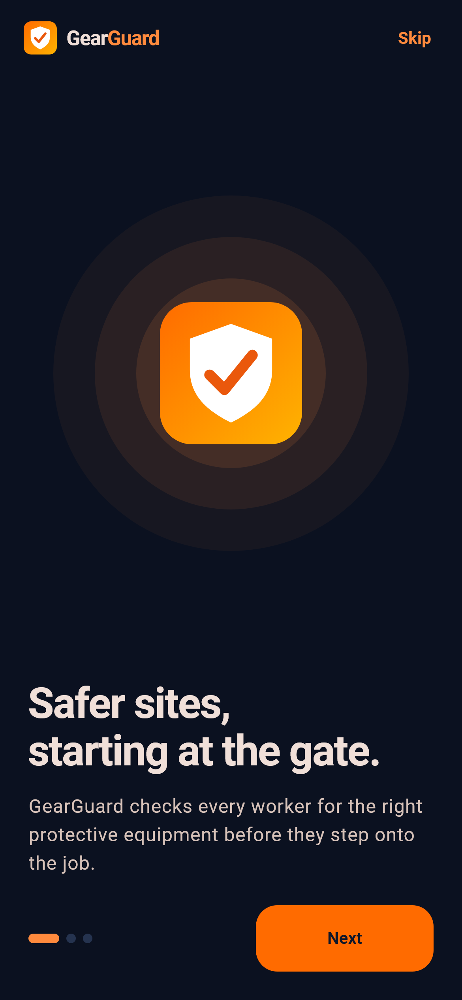
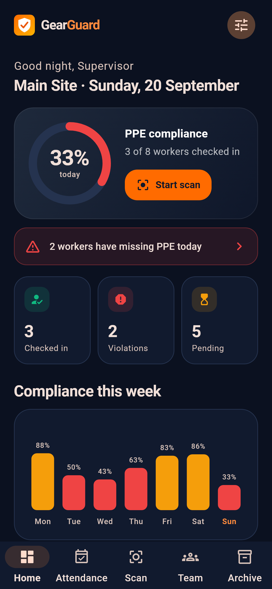
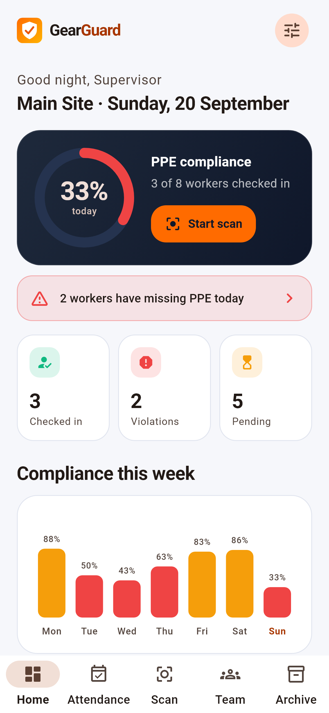
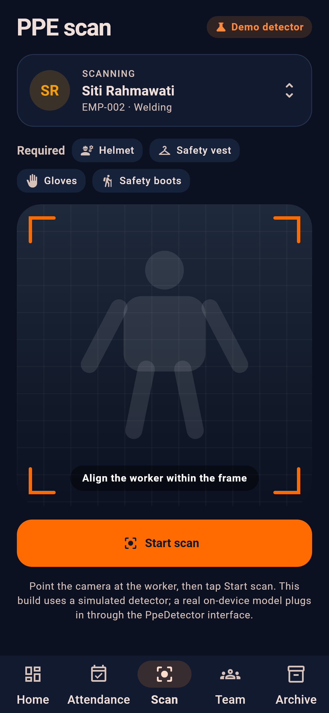
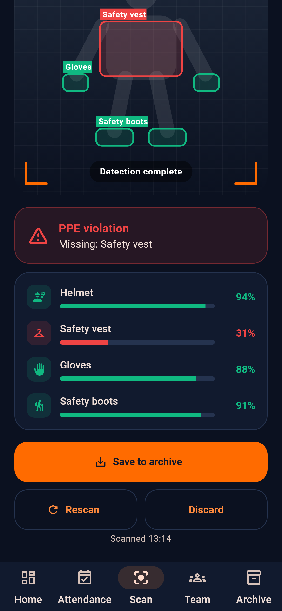
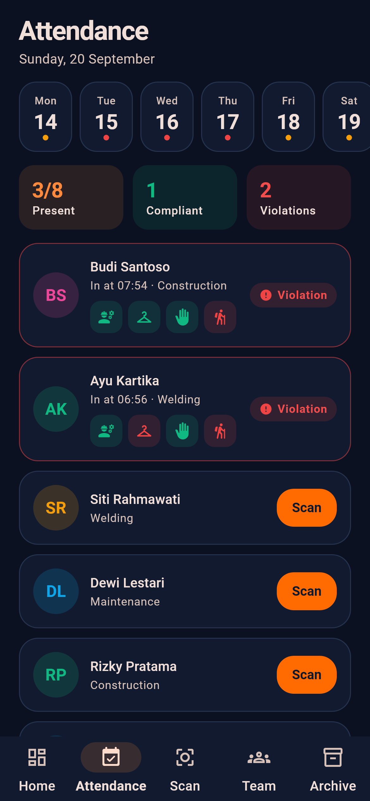
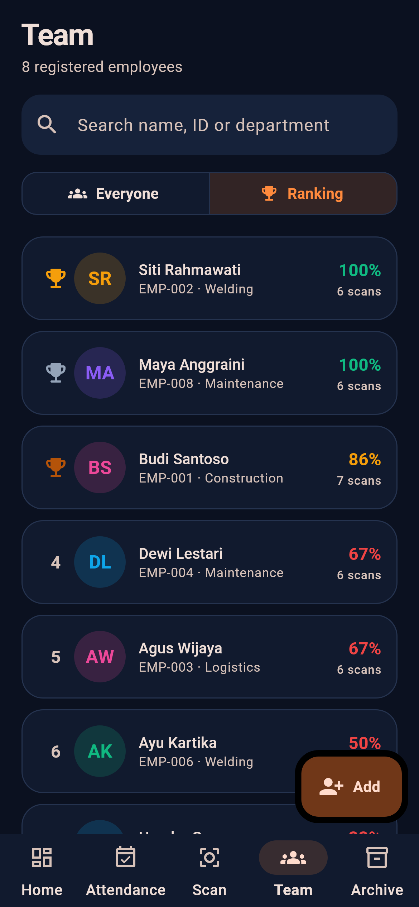
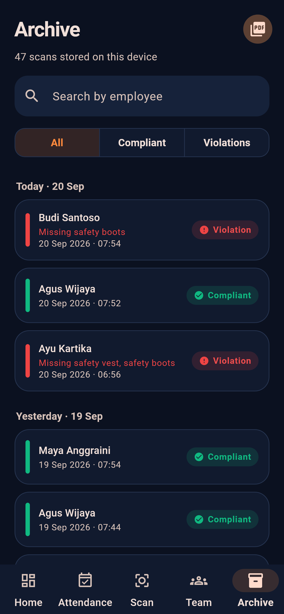

<p align="center">
  
</p>

<h1 align="center">GearGuard</h1>

<p align="center">
  <b>PPE compliance scanning, attendance and safety reporting for the workplace.</b><br/>
  A production-style Flutter app: clean architecture, a custom design system, light &amp; dark themes, and PDF reporting.
</p>

<p align="center">
  
  
  
  
  
</p>

---

## Overview

Before a worker steps onto a job site, a supervisor needs to know one thing: **are they wearing the right protective equipment?**

GearGuard turns that check into a few taps. Scan a worker, see exactly which items (helmet, vest, gloves, boots, goggles, mask) were detected and with what confidence, log the result, and roll everything up into attendance views, rankings and audit-ready PDF reports.

## Screenshots

<table>
  <tr>
    <td align="center"><br/><sub>Onboarding</sub></td>
    <td align="center"><br/><sub>Home · dark</sub></td>
    <td align="center"><br/><sub>Home · light</sub></td>
    <td align="center"><br/><sub>Scan</sub></td>
  </tr>
  <tr>
    <td align="center"><br/><sub>Scan result</sub></td>
    <td align="center"><br/><sub>Attendance</sub></td>
    <td align="center"><br/><sub>Team ranking</sub></td>
    <td align="center"><br/><sub>Archive</sub></td>
  </tr>
</table>

## Features

| Area | Highlights |
| --- | --- |
| **Home** | Live compliance ring for today, checked-in / violations / pending counters, 7-day trend, most-missed equipment, recent scans |
| **Scan** | Pick a worker, run a scan, see bounding boxes and a per-item confidence checklist, save or discard |
| **Attendance** | Day-by-day check-in list with PPE status per person; one tap to scan whoever hasn't checked in |
| **Team** | Add and search employees, per-person history and compliance, compliance **ranking** |
| **Archive** | Every scan grouped by day, filter by result, search by employee, detail view, delete |
| **PDF reports** | Branded report for one scan, one person, or the whole filtered archive — share or print |
| **Settings** | Required equipment, confidence threshold, violation alerts, site & supervisor, light / dark / auto theme, demo data |

## Detection: demo mode, real interface

The scanner runs against a **simulated detector** so the entire app can be explored without a camera or a trained model. Results are randomised, and the Scan screen says so ("Demo detector").

Detection lives behind one small interface, so a real on-device model (for example YOLO via a platform channel) plugs in without touching any screen:

```dart
abstract interface class PpeDetector {
  /// Confidence (0–1) for every [PpeItem] in the current frame.
  Future<Map<PpeItem, double>> detect();
}
```

```dart
runApp(App(prefs: prefs, detector: MyYoloDetector()));
```

## Architecture

```
lib/
├── app/        MaterialApp, dependency wiring, onboarding gate
├── core/       theme, formatters, shared widgets (logo, rings, charts, pills)
├── domain/     PpeItem, Employee, ScanRecord — pure Dart, JSON-serialisable
├── data/       PpeDetector, SafetyRepository (local storage), PDF report builder
├── cubits/     SafetyCubit, SettingsCubit, NavCubit (flutter_bloc)
└── features/   dashboard · scanner · attendance · employees · archive · settings · onboarding
```

- **State management:** `flutter_bloc` cubits with immutable states; derived values (compliance rate, ranking, miss counts) live on the state, not in widgets.
- **Persistence:** JSON in `shared_preferences`, which works on every platform including web.
- **Swappable seams:** detector injected through `RepositoryProvider`; storage hidden behind `SafetyRepository`.
- **Design system:** Material 3, safety-orange brand on deep slate, complete light and dark themes. Logo, compliance rings, weekly chart and detection overlay are custom-painted — no charting dependency.
- **Accessibility:** semantic labels on tappable cards, tooltips on icon buttons, and status is never conveyed by colour alone (every pill has an icon and text).

## Getting started

Requirements: Flutter 3.41+ (Dart 3.11+).

```sh
git clone <this-repo>
cd gearguard
flutter pub get
```

Run it:

```sh
# Web
flutter run -d chrome --target lib/main_production.dart

# Android / iOS (flavors: development, staging, production)
flutter run --flavor development --target lib/main_development.dart
```

Quality checks:

```sh
flutter analyze
flutter test
```

Regenerate the README screenshots (renders the real screens with the SDK's Roboto and Material Icons fonts):

```sh
flutter test tool/screenshots_test.dart --update-goldens
```

## Tests

Unit tests cover the domain model (compliance maths, JSON round-trip), deterministic demo data and the detector. Widget tests drive the app end to end: onboarding, running a scan and saving a violation, adding an employee, and filtering the archive.

## Research paper

An IEEE-format manuscript draft (compliance model, architecture, verification) lives in [`docs/paper`](docs/paper). It is a draft: the detector benchmark and usability study still have to be run before it can be submitted anywhere. See [`docs/paper/README.md`](docs/paper/README.md).

## Background

GearGuard is a from-scratch redesign of the earlier
[`ppe_apk_prototype`](https://github.com/afprayogi/ppe_apk_prototype), keeping the same product scope (scanner, employees, attendance, archive, PDF export, settings) with a new architecture, design system and brand.

## Roadmap

- [ ] Real camera preview and on-device YOLO detector behind `PpeDetector`
- [ ] SQLite storage for large histories
- [ ] Per-department reports and CSV export
- [ ] Localisation (Bahasa Indonesia)

## Tech stack

Flutter · Dart · flutter_bloc · shared_preferences · pdf · printing

## License

Released under the [MIT License](LICENSE).
